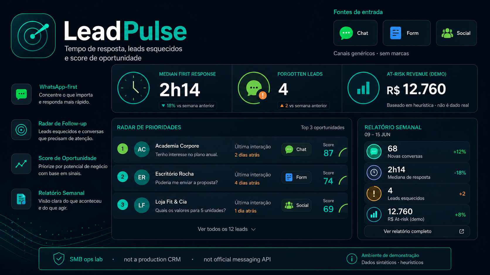
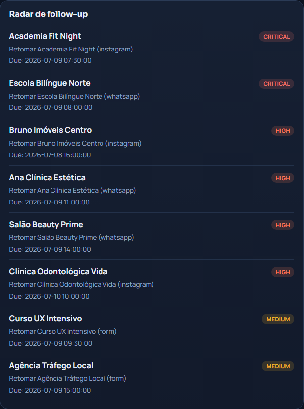
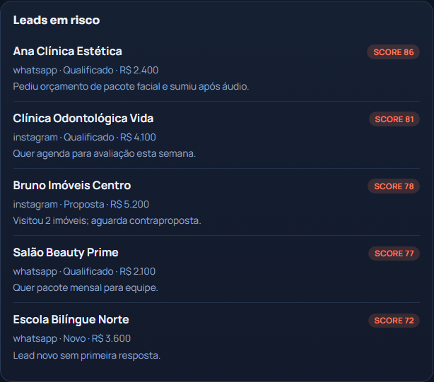
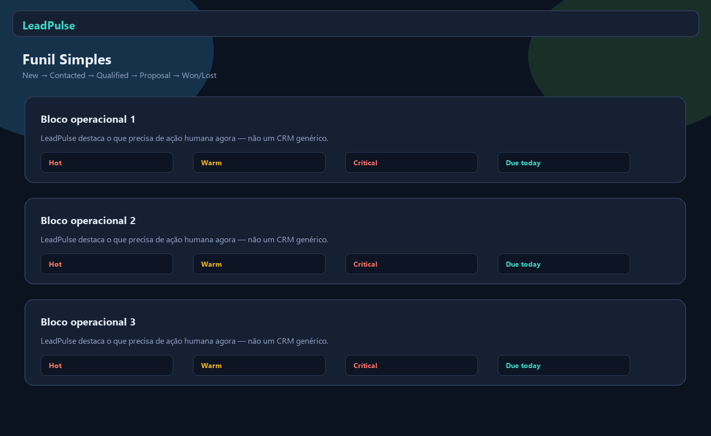
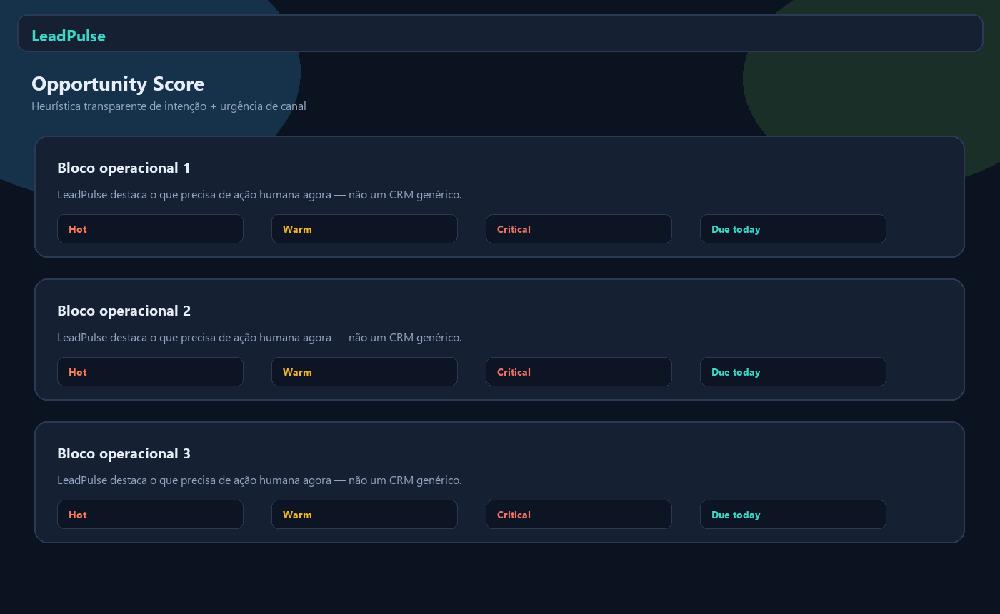
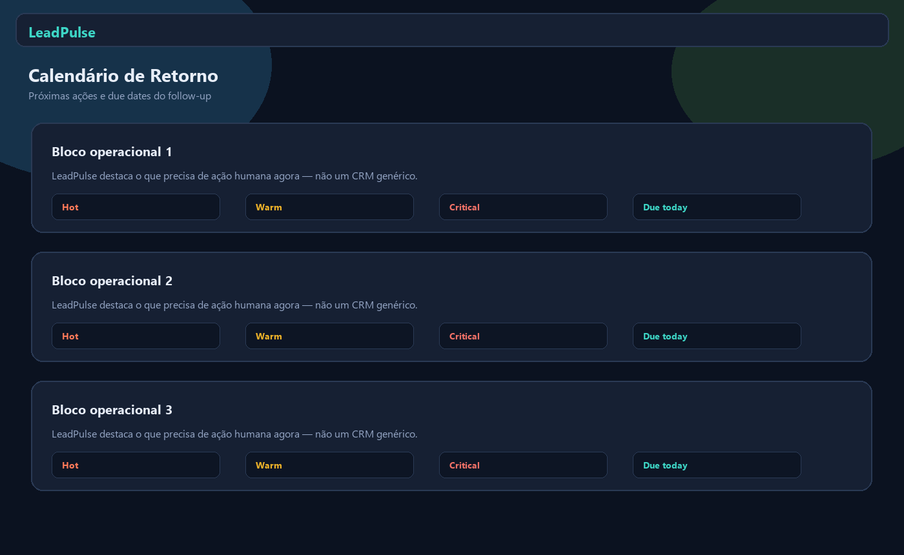
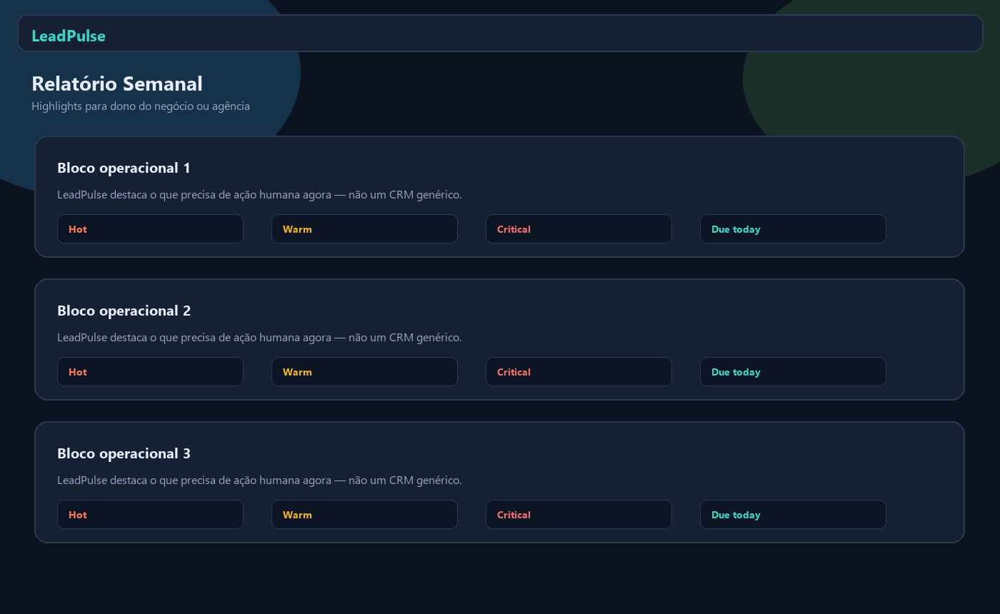

<div align="center">
  

  <h1>LeadPulse</h1>

  <p><strong>Analytics e follow-up radar WhatsApp-first para vendas SMB.</strong></p>
  <p><strong>WhatsApp-first lead analytics and follow-up radar for SMB sales.</strong></p>

  <p>
    <a href="#pt-br">PT-BR</a> ·
    <a href="#english">English</a> ·
    <a href="#live-demo">Live Demo</a> ·
    <a href="#stack">Stack</a> ·
    <a href="#architecture">Architecture</a> ·
    <a href="#quick-start">Quick Start</a> ·
    <a href="#author">Author</a>
  </p>

  <p>
    
    
    
    
    
    
  </p>

  <p>
    <a href="https://leadpulse-two.vercel.app"><strong>Live Demo</strong></a> ·
    <a href="https://github.com/BarujaFe1/LeadPulse"><strong>Repo</strong></a> ·
    <a href="https://barujafe.vercel.app/"><strong>Portfolio</strong></a> ·
    <a href="https://www.linkedin.com/in/barujafe/"><strong>LinkedIn</strong></a>
  </p>
</div>

<p align="center">
  
</p>

> **Lab / demo notice:** frontend-first cockpit with **synthetic** WhatsApp/Instagram/form leads. KPIs and opportunity scores are demo heuristics — **not** production metrics. No unofficial WhatsApp scraping; no illegal mass messaging.

---

## PT-BR

### Visão geral
O **LeadPulse** transforma leads de CSV/formulário/manual em funil, KPIs de tempo de resposta, radar de follow-up, score de oportunidade e relatório semanal.

### Problema
Negócios que vendem no WhatsApp/Instagram perdem receita por demora, falta de retorno e estágio não registrado — o CAC já foi pago.

### Para quem
Donos de negócio SMB, agências e analistas comerciais que precisam de rotina diária de follow-up (não um CRM enterprise).

### Funcionalidades
- Follow-up radar e inbox leve de leads
- KPIs de resposta (mediana, p90, não respondidos, receita em risco)
- Funil simples e score de oportunidade heurístico
- Motivos de perda e calendário de retorno
- Relatório semanal
- Engine client-side (`apps/web/lib/engine.ts`) + API FastAPI opcional

### Escopo e limites (honestos)
- MVP começa com CSV/export/formulário/manual — **sem** scraping do WhatsApp Web
- Não promove disparo em massa ilegal
- Integração oficial WhatsApp Business Platform = roadmap (não no lab)
- Demo pública = snapshot sintético no browser

---

## English

### Overview
**LeadPulse** turns CSV/form/manual leads into a funnel, response-time KPIs, follow-up radar, opportunity score and weekly report.

### Problem
Businesses selling on WhatsApp/Instagram lose revenue to slow replies, missing follow-ups and untracked stages — after CAC is already spent.

### Who it is for
SMB owners, agencies and sales analysts who need a daily follow-up routine (not an enterprise CRM).

### Features
- Follow-up radar and light leads inbox
- Response KPIs (median, p90, unanswered, revenue at risk)
- Simple funnel and heuristic opportunity score
- Lost reasons and return calendar
- Weekly report
- Client-side engine (`apps/web/lib/engine.ts`) + optional FastAPI API

### Scope and honest limits
- MVP starts with CSV/export/form/manual — **no** WhatsApp Web scraping
- Does not promote illegal mass messaging
- Official WhatsApp Business Platform integration is roadmap (not in the lab)
- Public demo = synthetic browser snapshot

---

## Live Demo

| Surface | URL |
|---|---|
| **Public lab** | [https://leadpulse-two.vercel.app](https://leadpulse-two.vercel.app) |
| **GitHub** | [https://github.com/BarujaFe1/LeadPulse](https://github.com/BarujaFe1/LeadPulse) |

**How to try:** open the lab → inspect follow-up radar → review response KPIs → open opportunity score / lost reasons → skim the weekly report.

> Alternate alias also live: [https://leadpulse-umber.vercel.app](https://leadpulse-umber.vercel.app) (README Live Demo follows the GitHub homepage field).

---

## Screenshots

<table>
  <tr>
    <td width="50%"><br /><sub><strong>Follow-up radar</strong></sub></td>
    <td width="50%"><br /><sub><strong>Leads inbox</strong></sub></td>
  </tr>
  <tr>
    <td width="50%"><br /><sub><strong>Response dashboard</strong></sub></td>
    <td width="50%"><br /><sub><strong>Simple funnel</strong></sub></td>
  </tr>
  <tr>
    <td width="50%"><br /><sub><strong>Opportunity score</strong></sub></td>
    <td width="50%"><br /><sub><strong>Lost reasons</strong></sub></td>
  </tr>
  <tr>
    <td width="50%"><br /><sub><strong>Return calendar</strong></sub></td>
    <td width="50%"><br /><sub><strong>Weekly report</strong></sub></td>
  </tr>
</table>

---

## Stack

| Layer | Technology |
|---|---|
| Web | Next.js 15, React 19, TypeScript, Recharts, Lucide |
| Engine (browser) | `apps/web/lib/engine.ts` + `demo-leads.ts` |
| API (optional) | FastAPI, Pandas, NumPy, pytest |

---

## Architecture

```txt
apps/
  web/
    app/              Next.js UI
    lib/              engine, demo-leads, api client
  api/
    app/services/     analytics, demo_data
assets/
```

Flow: lead intake → stage mapping → response-time KPIs → forgotten-lead rules → opportunity score → follow-up radar → weekly report.

---

## Quick Start

**Prerequisites:** Node.js 20+, Python 3.10+ (optional), Git.

### Windows integrated
```bash
.\start.bat
```

### Manual
```bash
# API (optional)
cd apps/api
python -m venv .venv
.venv\Scripts\activate
pip install -r requirements.txt
uvicorn app.main:app --reload --port 8000

# Web
cd apps/web
npm install
npm run dev
```

Without `NEXT_PUBLIC_API_URL`, the frontend uses the client-side engine (same mode as the Vercel demo).

---

## Technical decisions

- **WhatsApp-first ops, not enterprise CRM** — daily follow-up radar over pipeline theater
- **No unofficial scraping** — CSV/form/manual first; official Cloud API later
- **Heuristic opportunity score** kept explainable for SMB owners
- **Client-side demo engine** for a reliable public lab

---

## Roadmap

- Official WhatsApp Business Platform connector
- Agency multi-inbox workspaces
- Stronger lost-reason taxonomies
- Reminder integrations (calendar / tasks)
- Light auth for shared teams

---

## Author

**Felipe Alirio Baruja** — data / product / full-stack portfolio.

- Portfolio: [https://barujafe.vercel.app/](https://barujafe.vercel.app/)
- GitHub: [https://github.com/BarujaFe1](https://github.com/BarujaFe1)
- LinkedIn: [https://www.linkedin.com/in/barujafe/](https://www.linkedin.com/in/barujafe/)

---

## License

MIT — see [`LICENSE`](./LICENSE).
