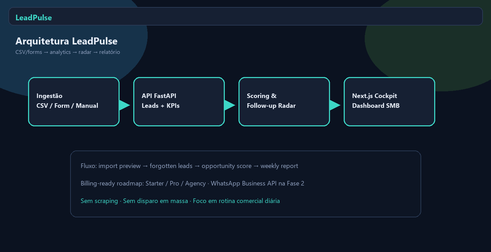

<div align="center">
  

  <h1>LeadPulse</h1>

  <p><strong>Analytics e follow-up radar para negócios que vendem pelo WhatsApp e Instagram.</strong></p>
  <p><strong>WhatsApp-first lead analytics, response-time KPIs and follow-up automation for SMB sales teams.</strong></p>

  <p>
    <a href="#1-visão-geral--overview">PT-BR / English Overview</a> •
    <a href="#-product-preview">Preview</a> •
    <a href="#-screenshots">Screenshots</a> •
    <a href="#️-stack--tecnologias">Stack</a> •
    <a href="#-arquitetura--architecture">Architecture</a> •
    <a href="#-quick-start--início-rápido">Quick Start</a> •
    <a href="#-autor--author">Author</a>
  </p>

  <p>
    
    
    
    
    
    
  </p>
</div>

<p align="center">
  
</p>

<p align="center">
  <a href="https://leadpulse-umber.vercel.app"><strong>🌐 Live Demo</strong></a>
  &nbsp;·&nbsp;
  <a href="https://github.com/BarujaFe1/LeadPulse"><strong>GitHub</strong></a>
</p>

> **Live demo note:** the public Vercel lab runs a **frontend-first** follow-up cockpit in the browser (12 synthetic WhatsApp/Instagram/form leads). KPIs, forgotten-lead rules and opportunity score are from the demo snapshot — **not** production metrics. The FastAPI package remains available for local/API workflows. No unofficial WhatsApp scraping.

---

## 1. Visão Geral / Overview

O **LeadPulse** é um SaaS de analytics e automação leve para negócios que vendem pelo WhatsApp/Instagram e perdem leads por demora, falta de follow-up ou atendimento inconsistente.

Ele captura conversas exportadas, formulários ou registros manuais e transforma em **funil, alertas, score de oportunidade e tarefas de follow-up**. Em vez de um CRM corporativo pesado, o produto entrega um cockpit comercial WhatsApp-first: tempo de resposta, leads esquecidos, motivos de perda e próximas ações.

O projeto foi desenvolvido por **Felipe Alirio Baruja** como peça de portfólio B2B para SMB — mostrando produto, analytics operacional, NLP leve e visão clara de monetização.

> **WhatsApp-first Notice**  
> O MVP começa com CSV/export/formulário/manual. Ele **não** faz scraping do WhatsApp Web, **não** depende de automação não oficial e **não** promove disparo em massa ilegal. Integração oficial via WhatsApp Business Platform entra na Fase 2.

---

## ✨ Product Preview

<p align="center">
  
</p>

O LeadPulse apresenta uma experiência de cockpit de vendas: cards de leads em risco, lista priorizada de follow-up, funil minimalista, score de oportunidade e relatório semanal para dono ou agência.

---

## 2. Por que este projeto importa? / Why this project matters

* **Lead perdido é receita perdida:** O CAC já ocorreu; a venda some por processo ruim de retorno.
* **WhatsApp é o CRM informal:** Conversas soltas, áudios, sumiços e retomadas sem estágio registrado.
* **Demo vende rápido:** Mostrar “leads quentes esquecidos” é um argumento comercial imediato para donos e agências.
* **Nicho > CRM genérico:** Foco em operação WhatsApp-first e analytics de follow-up, não pipeline enterprise.

---

## 🧠 O diferencial do LeadPulse / What makes LeadPulse different

### Português
O LeadPulse não é um CRM completo. Ele combina ingestão leve, funil simples e radar de follow-up em uma rotina diária utilizável por negócios locais e agências.

Ele mostra não apenas o volume de leads, mas também:
- quanto tempo demora a primeira resposta;
- quais oportunidades estão esquecidas;
- qual receita está em risco;
- quais tarefas priorizar agora;
- por que leads foram perdidos;
- qual temperatura/score da oportunidade.

### English
LeadPulse is not a full CRM. It combines light ingestion, a simple funnel and a follow-up radar into a daily routine for local businesses and agencies.

It shows not only lead volume, but also:
- how long first response takes;
- which opportunities are forgotten;
- how much revenue is at risk;
- which tasks to prioritize now;
- why leads were lost;
- the opportunity temperature/score.

---

## 🎯 Problema que resolve / The problem it solves

No dia a dia de clínicas, escolas, imobiliárias, cursos e serviços:
- o lead chama, pergunta preço e some;
- volta depois com áudio ou muda de assunto;
- ninguém registra estágio nem próximo retorno;
- a equipe não mede tempo de resposta;
- a agência não consegue provar follow-up consistente.

O **LeadPulse** cria clareza operacional onde antes havia conversa espalhada.

---

## 🧩 Proposta / Follow-up Analytics Pipeline

```txt
CSV / Form / Manual Entry
  ↓
Lead intake & stage mapping
  ↓
Response-time KPIs
  ↓
Forgotten-lead detection
  ↓
Opportunity score (heuristic / light AI)
  ↓
Follow-up task radar
  ↓
Lost-reason analytics
  ↓
Weekly owner/agency report
```

---

## 📸 Screenshots

<table>
  <tr>
    <td width="50%">
      
      <br />
      <sub><strong>Leads Inbox</strong> — canal, estágio, score e receita estimada em lista leve.</sub>
    </td>
    <td width="50%">
      
      <br />
      <sub><strong>Response Dashboard</strong> — mediana, p90, não respondidos e receita em risco.</sub>
    </td>
  </tr>
  <tr>
    <td width="50%">
      
      <br />
      <sub><strong>Simple Funnel</strong> — New → Contacted → Qualified → Proposal → Won/Lost.</sub>
    </td>
    <td width="50%">
      
      <br />
      <sub><strong>Opportunity Score</strong> — heurística transparente de intenção + urgência de canal.</sub>
    </td>
  </tr>
  <tr>
    <td width="50%">
      
      <br />
      <sub><strong>Lost Reasons</strong> — demora no retorno, preço e perda para concorrente.</sub>
    </td>
    <td width="50%">
      
      <br />
      <sub><strong>Return Calendar</strong> — próximas ações e due dates do follow-up.</sub>
    </td>
  </tr>
</table>

---

## 📄 Weekly Owner / Agency Report

<p align="center">
  
</p>

O relatório semanal consolida leads esquecidos, SLA de resposta, receita em risco, motivos de perda e highlights acionáveis para o dono do negócio ou a agência.

---

## 📌 Estudo de Caso / Case Study

### 📌 Estudo de Caso: Pipeline sintético WhatsApp-first
O dataset demo simula 12 leads de clínicas, imóveis, cursos, escolas e serviços com canais WhatsApp/Instagram/formulário. O LeadPulse calcula mediana de primeira resposta, detecta leads sem retorno, prioriza follow-ups críticos e agrega motivos de perda — com receita em risco destacada no cockpit.

A classificação de oportunidade é heurística e auditável: intenção na mensagem, urgência do canal e tempo de silêncio. Não há scraping nem automação não oficial.

### 📌 Case Study: Synthetic WhatsApp-first pipeline
The demo dataset simulates 12 leads across clinics, real estate, courses, schools and services from WhatsApp/Instagram/forms. LeadPulse computes first-response median, detects unanswered leads, prioritizes critical follow-ups and aggregates lost reasons — with at-risk revenue highlighted in the cockpit.

Opportunity classification is a transparent heuristic: message intent, channel urgency and silence time. No scraping and no unofficial automation.

---

## 🧭 Visual Story / Jornada Comercial

```txt
1. Importar CSV/export ou carregar o dataset demo
2. Ler o cockpit: esquecidos, mediana de resposta e receita em risco
3. Abrir o radar de follow-up priorizado
4. Inspecionar inbox e funil simples
5. Revisar motivos de perda
6. Classificar uma mensagem quente (score + próxima ação)
7. Fechar com o relatório semanal para dono/agência
```

---

## ⚙️ Funcionalidades Principais / Core Features

### Follow-up Radar
Fila priorizada (`critical` / `high` / `medium` / `low`) com due dates e contexto do lead.

### Response-time Dashboard
Mediana e p90 da primeira resposta, leads sem resposta e receita em risco.

### Opportunity Score
Score 0–100 com racional explícito — útil para priorizar atendimento humano.

### Lost Reasons
Agregação dos motivos de perda para corrigir processo (não só “culpar o lead”).

### Weekly Report
Highlights semanais prontos para dono do negócio ou reporting de agência.

### Billing-ready positioning
Planos sugeridos: **Starter R$59**, **Pro R$149**, **Agency R$399** (volume de leads/usuários/clientes).

---

## 🛠️ Stack / Tecnologias

### Frontend
- **Framework:** Next.js 15 (App Router) & React 19
- **Linguagem:** TypeScript
- **Gráficos:** Recharts
- **Ícones:** Lucide Icons

### Backend
- **Framework API:** FastAPI & Uvicorn (Python)
- **Modelagem:** Pydantic v2
- **Dados demo:** CSV seed + Pandas-friendly pipeline
- **Testes:** Pytest

### Produto / Roadmap
- Supabase Auth/Postgres/RLS (Fase 2+)
- WhatsApp Business Platform via provider (Fase 2)
- Stripe / Mercado Pago billing
- PostHog + Sentry

---

## 🧱 Arquitetura / Architecture

```text
LeadPulse/
├── apps/
│   ├── web/                         # Frontend Next.js (App Router)
│   │   ├── app/                     # Cockpit principal
│   │   ├── lib/                     # API client
│   │   └── types/                   # Tipos TypeScript
│   │
│   └── api/                         # Backend FastAPI
│       ├── app/
│       │   ├── api/                 # /demo, /leads, /classify, /methodology
│       │   ├── models/              # Schemas Pydantic
│       │   └── services/            # Analytics + demo seed
│       └── tests/                   # Pytest smoke tests
│
├── data/
│   └── seed/                        # whatsapp_leads_demo.csv
│
├── docs/                            # Pitch e metodologia
├── assets/                          # Ícone, hero, screenshots, social preview
├── scripts/                         # Geração de assets
├── start.bat                        # Launcher Windows
└── README.md
```

---

## 🧱 Visual Architecture

<p align="center">
  
</p>

LeadPulse follows a traceable commercial flow: CSV/form/manual intake → response KPIs → forgotten-lead detection → opportunity scoring → follow-up radar → weekly report.

---

## 🔁 Data Flow Pipeline

```txt
Raw Lead Input (CSV / Form / Manual)
  ↓
Stage Mapping
  ↓
Response-time Computation
  ↓
Forgotten Lead Rules (no first reply / 24h+ silence)
  ↓
Opportunity Heuristic Score
  ↓
Follow-up Task Prioritization
  ↓
Dashboard + Weekly Highlights
```

---

## 🚀 Quick Start / Início Rápido

### Live Demo
Abra o lab publicado: **[https://leadpulse-umber.vercel.app](https://leadpulse-umber.vercel.app)**

### Pré-requisitos
- **Node.js** v20 ou superior
- **Python** v3.10+ (preferencialmente 3.12) — opcional para o stack local com FastAPI
- **Git**

### Opção 1 — Execução integrada no Windows
```bash
start.bat
```
Sobe a API FastAPI (`8000`), o frontend Next.js (`3000`) e abre o navegador.

### Opção 2 — Execução manual

#### 1. Backend FastAPI (`apps/api`)
```bash
cd apps/api
python -m venv .venv
.venv\Scripts\activate            # Windows
source .venv/bin/activate          # Linux/macOS
pip install -r requirements.txt
uvicorn app.main:app --reload --port 8000
```
*API em [http://127.0.0.1:8000](http://127.0.0.1:8000) · Docs em `/docs`.*

#### 2. Frontend Next.js (`apps/web`)
```bash
cd apps/web
npm install
npm run dev
```
*Frontend em [http://localhost:3000](http://localhost:3000).*

Sem `NEXT_PUBLIC_API_URL`, o frontend usa o **engine client-side** (mesmo snapshot da demo Vercel). Com a API local, defina `NEXT_PUBLIC_API_URL=http://127.0.0.1:8000`.

---

## 🧪 Scripts e Testes / Scripts and Testing

### Backend
```bash
cd apps/api
.venv\Scripts\python -m pytest
```

### Frontend
```bash
cd apps/web
npm run lint
npm run typecheck
npm run build
```

---

## 🛡️ Escopo, Compliance e Boas Práticas

* **Sem scraping do WhatsApp Web**
* **Sem disparo em massa ilegal**
* **MVP offline-friendly** com CSV/export/manual
* **Classificação explicável** (heurística, não caixa-preta)
* **Consentimento** exigido para análise profunda de conversas (Fase 3)

---

## 🧭 Roadmap do Produto

* **MVP:** CSV/form/manual, estágios, follow-up tasks, score, dashboard, relatório semanal, billing preparado
* **Fase 2:** WhatsApp Business API (provider), Instagram lead forms, templates, alertas, scoring avançado, multi-cliente (Agency)
* **Fase 3:** Análise de conversas com consentimento, automação de follow-up, attribution simples, previsão de fechamento, benchmarking por atendente

---

## 💼 Valor para Portfólio / Portfolio Value

O LeadPulse demonstra:
- produto B2B para SMB com tese de monetização clara;
- analytics operacional e automação leve;
- NLP/heurística de classificação;
- arquitetura full-stack pronta para multi-tenant;
- disciplina de escopo (não virar CRM genérico cedo demais).

---

## 📚 Documentação Complementar

- [docs/portfolio_pitch.md](./docs/portfolio_pitch.md) — pitch, demo script e one-liner
- [docs/technical_methodology.md](./docs/technical_methodology.md) — métricas, scoring e limites do MVP

---

## 🖼️ GitHub Social Preview

```txt
assets/social-preview.png
```
*Dimensão recomendada: 1280x640, <1MB. Upload em: Repository Settings → Social Preview.*

---

## 🔖 GitHub Repository Metadata

### About sugerido
```txt
WhatsApp-first lead analytics and follow-up radar for SMB sales — response-time KPIs, forgotten leads, opportunity scoring and weekly reports.
```

### Topics sugeridos
```txt
lead-management
whatsapp
follow-up
sales-analytics
smb
saas
nextjs
fastapi
typescript
python
portfolio-project
crm-lite
opportunity-scoring
agency-tools
```

---

## 👤 Autor / Author

Desenvolvido por **Felipe Alirio Baruja**.

- **Portfolio:** [barujafe.vercel.app](https://barujafe.vercel.app/)
- **GitHub:** [@BarujaFe1](https://github.com/BarujaFe1)
- **LinkedIn:** [Gustavo Felipe Alirio Baruja](https://www.linkedin.com/in/barujafe/)

---

## 📄 Licença / License

MIT License. Copyright (c) 2026 Felipe Alirio Baruja.
O código está disponível sob a licença MIT caso o arquivo `LICENSE` esteja presente no repositório.
